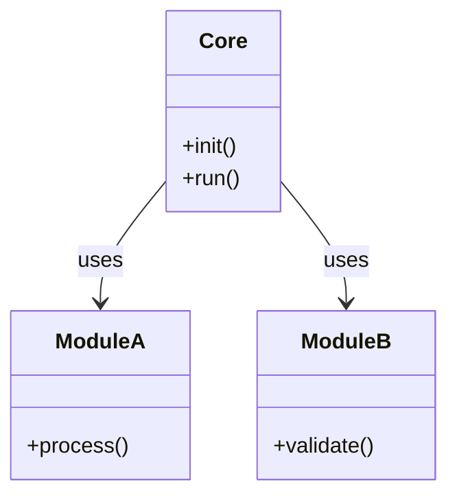

# {planName} – Comprehensive Execution Blueprint
**Generated:** {A_Now} (UTC: {A_NowUTC})
**File:** `{fileName}`**

---

## 1. PROBLEM STATEMENT
- **Core Issue (1 sentence):** _[FILL]_
- **Observed Symptoms:**
  1. _[FILL]_
- **Desired Outcome:** _[FILL]_

## 2. ROOT-CAUSE HYPOTHESES (Modular)
| ID | Hypothesis | Test Method | Owner |
|---|------------|-------------|-------|
| H1 | _[FILL]_   | _[FILL]_    | _[FILL]_ |

## 3. SOLUTION ARCHITECTURE (Object-Oriented)

### Module Registry
| Module | Responsibility | Input | Output | File |
|---|---|---|---|---|
| Core   | Orchestration  | -     | -      | core.ahk |
| A      | _[FILL]_       | _[FILL]_ | _[FILL]_ | mod_a.ahk |

## 4. IMPLEMENTATION ROADMAP (Sprints)
- [ ] **Sprint 0** – Scaffold folders / repo
- [ ] **Sprint 1** – Core + Module A stub
- [ ] **Sprint 2** – Module B + integration tests

## 5. TESTING & DEBUGGING MATRIX
| Test ID | Scope | Preconditions | Steps | Expected | Actual | Status |
|---|---|---|---|---|---|---|
| T1      | Unit  | _[FILL]_      | _[FILL]_ | _[FILL]_ |        |        |

## 6. RISKS & MITIGATION
| Risk | Probability | Impact | Mitigation |
|---|---|---|---|
| R1   | Low         | High   | _[FILL]_   |

## 7. DEPLOYMENT CHECKLIST
- [ ] Dry-run in staging
- [ ] Version: `{timestamp}`
- [ ] Notify stakeholders

## 8. POST-MORTEM / LESSONS LEARNED
_To be filled after closure._

---
*This plan is **modular**, **self-contained**, and **timeless** — every row = one file/function.*
